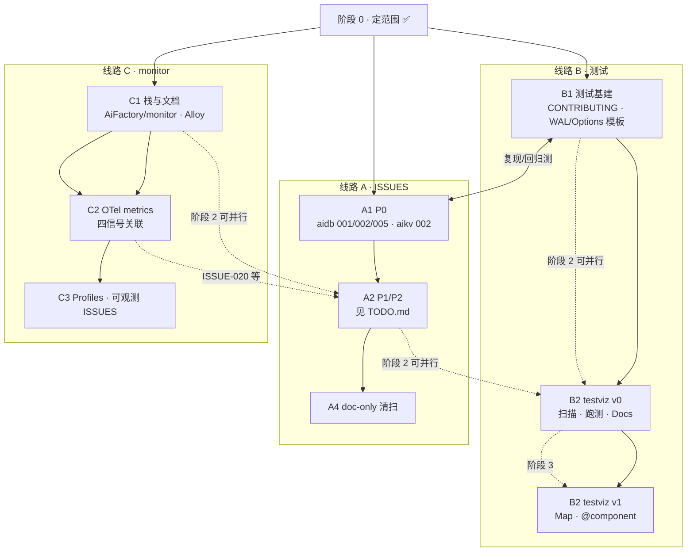
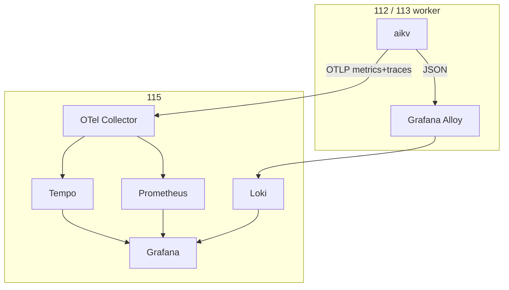

# 后续开发计划 (v1 实施计划)

> 过程文档, 位于 `AiKv-Workflow/backup/`. **未开始实施** — 范围与选型已定; 本文为三线路 **执行顺序 + checklist**.  
> 架构细节见文末 **[monitor 定案](#aifactory-monitor-定案)**、**[testviz 定案](#aifactory-testviz-定案)**.

**状态**: v1 实施计划 (2026-06-16)  
**下一步**: **A3 P3** ✅ → 并行 **B2-v0** ✅ / **C1**

**相关**:


| 文件                                                                              | 用途                |
| ------------------------------------------------------------------------------- | ----------------- |
| [TODO.md](TODO.md)                                                              | ISSUES P0–P3 条目顺序 |
| [aidb/ISSUES.md](../../aidb/ISSUES.md) · [aikv/ISSUES.md](../../aikv/ISSUES.md) | 条目详情              |
| [PROGRESS.md](PROGRESS.md)                                                      | 文档整理 (已完成)        |
| [PLAN-SESSION-PROMPT.md](PLAN-SESSION-PROMPT.md)                                | 开发阶段新会话开场模板       |
| [wiqun-factory/monitoring](../../wiqun-factory/monitoring/)                     | monitor 迁移参考      |


---

## 总目标


| #     | 线路            | 产出                                   | 主要位置                                                             |
| ----- | ------------- | ------------------------------------ | ---------------------------------------------------------------- |
| **A** | **ISSUES 修复** | 按优先级修代码或关条目                          | `aidb/`, `aikv/`                                                 |
| **B** | **测试体系**      | 分层回归 + **testviz** 可视化               | `aidb/tests`, `aikv/tests`, `aikv/e2e`, `**AiFactory/testviz/`** |
| **C** | **监控系统**      | **monitor** 栈 + OTel metrics + 四信号关联 | `**AiFactory/monitor/`**, `aikv` observability                   |


**不做**: 一次性清 ISSUES; aidb 独立 HTTP/OTel; 推倒现有 `tests/`; OTel Logs; Alertmanager v1; 应用内 profiling 埋点.

**AiFactory 工具目录**:

```text
AiFactory/
├── monitor/     # 可观测性栈 (115 中心 + 112/113 Alloy)
├── testviz/     # 测试/文档可视化
└── scripts/ …
```

---

## 实施顺序 (三线路)



| 阶段 | 线路 | 内容 | 依赖 |
|------|------|------|------|
| **0** | 全体 | 测试分层、monitor/testviz 选型 | ✅ 已完成 |
| **1** | **B1** | CONTRIBUTING、P0 回归测模板 (WAL、Options) | — |
| **1′** | **A·P0** | aidb 001+002+005, aikv 002 | **与 B1 重叠**, 每条带测试 |
| **2** | **A·P1/P2** | 见 [TODO.md](TODO.md); doc-only 批量 close | B1 |
| **2′** | **B2** | testviz v0 (扫描+跑测+Docs); v1 Map/关联 | B1; `@component` 可与文档一并定 |
| **3** | **C1** | `AiFactory/monitor/` 部署, Alloy, dashboard, 监控文档 | AiFactory compose |
| **3′** | **C2** | aikv/aidb OTel metrics OTLP; exemplars; log trace_id; 关联验收 | C1 + aikv `--features monitoring` |
| **4** | **C3** | Pyroscope + Alloy eBPF (按需); ISSUE-020/021–023 与告警对齐 | C2 |


**并行建议**:

- **B1 + A·P0** 同一时期 (测试与修复一体)  
- **B2 testviz** 与 **A·P1** 可并行  
- **C1 monitor 栈** 与 **A·P1** 可并行 (运维向, 少改业务)  
- **C2 代码** 宜在 C1 栈可联调后; 与 **A·P3 可观测 ISSUES** 可合并 PR

---

## 线路 A — ISSUES 修复

> 详情与批次表: [TODO.md](TODO.md). 流程: 复现 → 测试 → 修/关 → 更新 `ISSUES.md`.

### 批次


| 批次     | 优先级      | 内容                                                                  | 状态  |
| ------ | -------- | ------------------------------------------------------------------- | --- |
| **A0** | 准备       | 确认 P0 范围; doc-only 关闭策略                                             | [x] |
| **A1** | **P0**   | aidb **001+002+005** ✅; aikv **002** ✅ | [x] |
| **A2** | **P1**   | aikv **001/006/012/013/016** ✅ (P1 序 5–9 全部关闭) | [x] |
| **A3** | **P2**   | **014** ✅; **004** ✅ (doc-only); **003** ✅; **009** ✅; **010** ✅; P2 代码债已清 | [x] |
| **A4** | doc-only | 批量 `closed (doc-only)`                                              | [x] |


### 推荐第一条开发线 (不变)

```text
aidb 001+002+005 ✅ → aikv 002 ✅ → aikv 006 ✅ → P1 (001/012/013/016) ✅ → A4 doc-only ✅ → 014 ✅ → 004 ✅ → 003 ✅ → 009 ✅ → 010 ✅ → P2 按需
```

### 与 monitor 交叉


| ISSUE                       | 处理线路                               |
| --------------------------- | ---------------------------------- |
| **020** blocked_clients     | **C2/C4** — 修写入或告警/面板标注            |
| **021–023** refresh/slowlog | **C4** — 产品决策 + 文档                 |
| **013** CLUSTER INFO        | **A2** — 集群运维; 与 monitor 面板无关但影响排障 |


---

## 线路 B — 测试体系

### B1 — aidb/aikv 测试基建 (产品仓)


| 项    | 内容                                        | 状态     |
| ---- | ----------------------------------------- | ------ |
| B1.1 | CONTRIBUTING: 新 bugfix **必带回归测**          | [ ]    |
| B1.2 | aidb: ISSUE-001/002 **WAL 崩溃恢复** 测试模板     | [x]    |
| B1.3 | aikv: ISSUE-002 **生产 Options** 集成测        | [x]    |
| B1.4 | 慢测/stress **标签** + CI 矩阵 (待定)             | [ ]    |
| B1.5 | E2E: 保留 `aikv/e2e/*.sh`; **新用例优先 pytest** | [ ] 持续 |


**分层** (已定): L0–L4; 组件测在 `tests/` 内; E2E 在 `aikv/e2e/`.

### B2 — AiFactory testviz (可视化)


| 阶段          | 内容                                                     | 状态  |
| ----------- | ------------------------------------------------------ | --- |
| **B2-v0**   | `config.toml` 扫 aidb/aikv; 测试树; 单测运行+SSE; Docs+Mermaid | [x] |
| **B2-v0.1** | 扫 `e2e/*.sh` / pytest; (可选) React Flow + component 筛测  | [ ] |
| **B2-v1**   | `@component` / frontmatter 定稿; Map↔Tests↔Docs 深链接      | [ ] |


**技术栈**: Rust Axum 后端 + React/TS/Vite; 扫描驱动, 不手维护 Web 清单. 详见 [testviz 定案](#aifactory-testviz-定案).

**不阻塞**: A·P0、C1 均可与 B2-v0 并行.

---

## 线路 C — 监控系统 (AiFactory/monitor)

### C1 — 栈与文档


| 项    | 内容                                                                 | 状态  |
| ---- | ------------------------------------------------------------------ | --- |
| C1.1 | `AiFactory/monitor/` ← wiqun-factory; Promtail → **Alloy**         | [ ] |
| C1.2 | **115**: Prometheus, Grafana, Loki, Tempo, Collector; Grafana 告警示例 | [ ] |
| C1.3 | **112/113**: Alloy (log); 对齐 aikv 容器名 `*aikv`*                     | [ ] |
| C1.4 | Dashboard: `wiqun_*` → `aikv_*` / `aidb_*`                         | [ ] |
| C1.5 | **监控文档** (见 monitor 定案「监控文档」表)                                     | [ ] |


### C2 — aikv/aidb 代码 + 四信号关联


| 项    | 内容                                                               | 状态  |
| ---- | ---------------------------------------------------------------- | --- |
| C2.1 | **OTel Metrics SDK + OTLP**; Collector → Prometheus remote write | [ ] |
| C2.2 | 指标名/契约测与 `observability-reference` 一致; 过渡期 scrape 对照             | [ ] |
| C2.3 | **Exemplars** (metrics↔traces)                                   | [ ] |
| C2.4 | JSON log **trace_id/span_id**; Tempo↔Loki; 统一 resource/labels    | [ ] |
| C2.5 | observability **契约测试**扩展                                         | [ ] |
| C2.6 | 验收后弱化或移除 scrape `/metrics`                                       | [ ] |


### C3 — 按需


| 项    | 内容                                                             | 状态  |
| ---- | -------------------------------------------------------------- | --- |
| C3.1 | 115 **Pyroscope** + Grafana Profiles; Alloy **pyroscope.ebpf** | [ ] |
| C3.2 | release **debug symbols** (火焰图可读)                              | [ ] |
| C3.3 | ISSUE-020 / 021–023 与告警、面板一致                                   | [ ] |


**拓扑**: 112/113 worker, 115 监控中心. **Traces + Metrics**: aikv OTLP → 115 Collector. **Logs**: JSON → Alloy → Loki. 详见 [monitor 定案](#aifactory-monitor-定案).

---

## 统一 checklist (按建议时间线)

### 现在优先 (阶段 1)

- [x] **B1.1–B1.3** 测试基建 + **A1** P0 ISSUES (B1.2 ✅ B1.3 ✅; A1: aidb 001/002/005 ✅, aikv 002 ✅)
- [x] **A0** 确认 ISSUES 批次 (P0 已关: aidb 001/002/005, aikv 002; A2 P1 序 5–9 见 TODO.md; doc-only 批量 close 策略不变)

### 其次 (阶段 2, 可并行)

- [x] **A2** P1 ISSUES (aikv 001/006/012/013/016 全部 closed)
- [x] **B2-v0** testviz 最小可用  
- [ ] **C1** monitor 栈 + 文档 (可与 A2 并行)

### 再次 (阶段 3)

- [ ] **C2** OTel metrics + 四信号关联  
- [ ] **B2-v1** testviz component / Map (与文档规范同步)

### 按需 (阶段 4)

- [x] **A3** P2 ISSUES (014 ✅; 004 ✅ doc-only; 003 ✅; 009 ✅; 010 ✅; 017–019 doc-only 已关)
- [x] **A3** P3 ISSUE-005 (BlockingRegistry evict) ✅
- [x] **A3** P3 ISSUE-020 (`blocked_clients`) ✅
- [x] **A4** doc-only 清扫 (aikv 007/008/011/015/017–019/021–023)
- [ ] **C3** Profiles + 可观测 ISSUES 收尾  
- [ ] **B1.4** CI 慢测矩阵

---

## 实施门控

1. **本计划 v1** 确认后再开长期开发分支
2. **每条 ISSUE / monitor 子项 / testviz 里程碑** 可单独对话 + 小步 PR
3. 更新各仓 `ISSUES.md`、`CHANGELOG`; 不混进 module 迁移历史

---

## AiFactory monitor (定案)

> 位置: `~/code/database/AiFactory/monitor/`. 拓扑: **112/113 worker**, **115 监控中心**.

### 部署

| node | server |
| ---- | ------ |
| 115 | Prometheus, Grafana, Loki, Tempo, OTel Collector, Pyroscope (按需) |
| 112/113 | aikv, **Grafana Alloy**, (可选) node-exporter, cAdvisor |

**告警**: Grafana Unified Alerting (无 Alertmanager v1).

### 数据流


| 信号       | 路径                                               |
| -------- | ------------------------------------------------ |
| Metrics  | aikv **OTLP** → Collector → Prometheus → Grafana |
| Traces   | aikv OTLP → Collector → Tempo                    |
| Logs     | JSON → Alloy → Loki                              |
| Profiles | Alloy eBPF → Pyroscope (外挂, 无 aikv 埋点)           |


**aidb**: 无 HTTP/OTel; metrics 经 aikv OTLP 送出.

### 四信号关联 (C2 验收)

logs↔traces (trace_id, Tempo↔Loki); metrics↔traces (exemplars); 统一 `service.name` / host / node_id; profiles 同 `service_name`.

### 监控文档 (C1.5)


| 文档         | 路径                                                      |
| ---------- | ------------------------------------------------------- |
| 栈部署        | `AiFactory/monitor/README.md`                           |
| 被监控方       | `AiFactory/docs/MONITORING.md`                          |
| aikv 模块/部署 | `aikv/docs/modules/observability.md`, `DEPLOYMENT.md`   |
| aidb 模块    | `aidb/docs/modules/observability.md`                    |
| Grafana    | `AiFactory/monitor/config/grafana/dashboards/README.md` |


### 架构图




---

## AiFactory testviz (定案)

> 位置: `~/code/database/AiFactory/testviz/`. **扫描驱动**; 不手维护测试清单.


| 层   | 选型                                     |
| --- | -------------------------------------- |
| 后端  | Rust + Axum (scanner, runner, SSE)     |
| 前端  | React + TS + Vite, Mermaid, React Flow |
| E2E | 保留 shell; 新增优先 pytest                  |


```text
testviz/
├── config.toml
├── server/   # scanner, index, runner
└── web/      # Map, Tests, Docs
```

**链接约定 (草案)**: 文档 `component:`; 测试 `/// @component`; e2e `# @component`; 图节点 JSON — v1 与 B2-v1 定稿.

---

## 变更 log


| 版本        | 日期         | 说明                                                            |
| --------- | ---------- | ------------------------------------------------------------- |
| v1.17     | 2026-06-23 | **B2-v0**: `AiFactory/testviz/` 扫描+跑测+SSE+Docs/Mermaid 最小可用 |
| v1.16     | 2026-06-23 | **A3 ISSUE-020**: `blocked_clients` 阻塞命令计数 (BlockedClientGuard) |
| v1.15     | 2026-06-23 | **A3 ISSUE-005**: BlockingRegistry 后台 evict_expired (1s tick) |
| v1.14     | 2026-06-22 | **A3 ISSUE-010**: MIGRATE AUTH2 (解析 + TCP AUTH user pass; KEYS 停止符) |
| v1.13     | 2026-06-22 | **A3 ISSUE-009**: 实现 JSON.MGET (顶层 + Lua redis.call) |
| v1.12     | 2026-06-22 | **A3 ISSUE-003**: 恢复 GETRANGE/SETRANGE (Redis 7 / oldmain 语义) |
| v1.11     | 2026-06-22 | **A3 ISSUE-004**: doc-only — MSETNX 不实现; 移除 cluster_route dead `msetnx` |
| v1.10     | 2026-06-22 | **A3 ISSUE-014**: 移除 GossipState dead code; NODES link-state ← MetaRaft |
| v1.9      | 2026-06-22 | **A4 doc-only**: aikv **007/008/011/015/017–019/021–023** closed (module 已覆盖) |
| v1.8      | 2026-06-22 | **A2 P1**: aikv **ISSUE-012** closed (EVAL KeyLock 30s 锁等待超时) |
| v1.7      | 2026-06-22 | **A2 P1**: aikv **ISSUE-001** closed (MGET wrong-type → Redis 7 per-key nil, 双引擎统一) |
| v1.6      | 2026-06-22 | **A2 P1**: aikv **ISSUE-016** closed doc-only (CLUSTER RESET 明确 ERR + 排障文档) |
| v1.5      | 2026-06-22 | **A2 P1**: aikv **ISSUE-013** closed (CLUSTER INFO cluster_state fail 判定) |
| v1.4      | 2026-06-22 | **A0** 批次确认; aikv **ISSUE-006** closed (MIGRATE KEYS + COPY) |
| v1.3      | 2026-06-22 | 阶段1: aidb ISSUE-005 完成; **A1 P0 全部关闭** |
| v1.2      | 2026-06-22 | 阶段1: aikv ISSUE-002 + B1.3 生产 Options 集成测 |
| v1.1      | 2026-06-22 | 阶段1: aidb ISSUE-001/002 + B1.2 完成; A1 P0 部分推进 |
| v0        | 2026-06-18 | 四阶段初稿                                                         |
| v0.1–v0.4 | 2026-06-16 | testviz / monitor 选型、OTel metrics、关联、目录 `monitor/`+`testviz/` |
| **v1**    | 2026-06-16 | 重组为三线路 A/B/C 实施计划; 实施顺序 Mermaid 图 |


