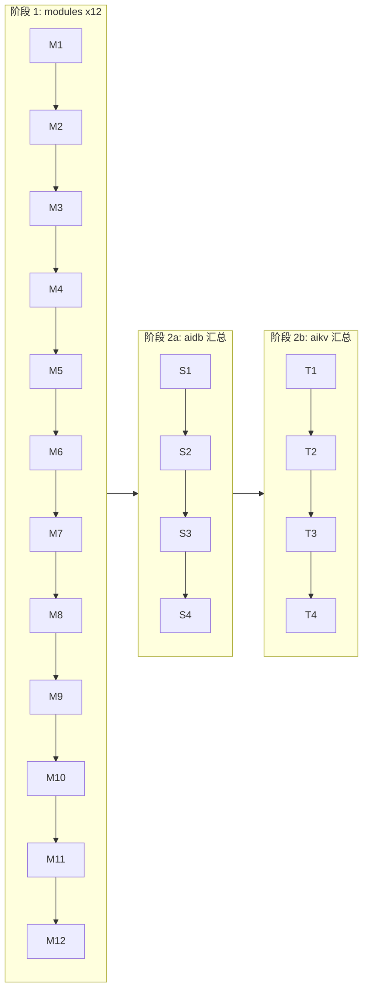

# AiDb / AiKv 文档整理方案

> 过程文档, 存放于 `AiKv-Workflow/backup/` (本仓库, 有 git 记录). 不进入 aidb / aikv 仓库.

**日期**: 2026-06-16  
**状态**: 已确认 (modules 划分、章节顺序、每章流程 0–4、逐步确认门控、Module Skill 内容格式 2026-06-16 更新)

---

## 目标

为 **个人继续开发** 整理 aidb 与 aikv 文档. 最终只保留 aidb / aikv 两个仓库; 其它仓库 (aidb-oldmain, aikv-oldmain, wiqun-db, wiqun-kv, wiqun-factory, WiQunTools) 在验收后删除.

## 原则

1. **aidb / aikv 只放当前有效文档** — 面向「现在代码怎么用、怎么组织」, 不记录迁移历史.
2. **所有整理过程放在 AiKv-Workflow/backup/** — 索引、进度、旧文档归档、本方案 (弃用的 AiKv-Workflow 仓库承载, 便于版本管理).
3. **按章节渐进** — 先定文档骨架, 再逐章完善; 完善一章, 消化相关旧文档, 清掉源侧干扰.
4. **每步确认门控** — 每章流程 0–4 每一步先讨论、你确认后, 才进入下一步或写入 aidb/aikv.
5. **旧文档不迁入 inventory 表格** — WiQunTools 等功能清单仅作查漏参考, 不复制进项目.
6. **其它仓库文档整理期间只读不改** — 源侧文件可在消化后直接删除.

## 不做的事

- 不在 aidb / aikv 中建立 `refactoring/`、`module-map`、迁移对照表
- 不整体迁入 WiQunTools inventory
- 不在项目仓库维护整理进度表

---

## 工作流

```
Step 0  确定 aidb / aikv 文档骨架 (见下文「目标文档结构」)
        初始化 backup/INDEX.md + backup/PROGRESS.md

Step 1  阶段 1: 按「章节推进顺序」单链写完 aidb + aikv 全部 modules (12 步)
        每章按「每章流程 (0–4)」执行; **每步与你确认后再进下一步**; 章末 PROGRESS ✅

Step 2  阶段 2: 先 aidb 根文档汇总 (步 13–18), 再 aikv 根文档汇总 (步 19–24)
        汇总章节同样适用「每章流程 (0–4)」, oldmain 对比深度以模块级为主

Step 3  验收 (见「验收标准」); PROGRESS 与 INDEX 全部 ✅

Step 4  删除 aidb-oldmain、aikv-oldmain、wiqun-db、wiqun-kv、wiqun-factory、WiQunTools
        AiKv-Workflow/backup/ 保留 (git 历史); archive/ 内旧文档副本可按需清理
```

### 每章流程 (0–4)

每写完一篇 module (或阶段 2 汇总文档), 在 **backup/** 留过程记录; **aidb/aikv 正文只写当前实现**.

#### 确认门控 (必须)

**每一步 (0→1→2→3→4) 都必须先与你讨论, 你明确确认后, 才能进入下一步.**


| 规则     | 说明                                              |
| ------ | ----------------------------------------------- |
| 禁止跳步   | 未确认当前步产出, 不开始下一步 (含不写 aidb/aikv 正文、不删旧文档)       |
| 每步交付   | 助手汇总: 发现、结论、草稿或拟写入内容 → 等你回复「可以 / 调整…」           |
| 调整     | 你提出修改意见后, 仍算当前步, 修订后再次确认                        |
| 换章     | 新开一章时从步 0 重新开始, 同样逐步确认                          |
| 步 4 拆分 | 正文 **先出草稿讨论**; 确认后再写入仓库、更新 INDEX/PROGRESS、消化旧文档 |


| 步     | 名称    | 动作                                                                                                         | 产出 (backup/)        | 确认前交付物 (与你讨论)            |
| ----- | ----- | ---------------------------------------------------------------------------------------------------------- | ------------------- | ------------------------ |
| **0** | 定范围   | 对照 PROGRESS 与 modules↔src 表; 列出本章 `src/` 路径与入口文件                                                           | INDEX 本章行: 范围清单     | 拟读文件列表 + 本章边界            |
| **1** | 读新代码  | 以 **当前 aidb/aikv 源码** 为准; 梳理职责、类型、主流程; 必要时跑对应 tests                                                        | bullet 草稿           | 职责/代码地图/主流程要点            |
| **2** | 查旧文档  | 按序查: `backup/{aidb,aikv}/` → `*-oldmain` → WiQunTools inventory 段 → wiqun-*; 标记 **仍有效 / 已过时 / 设计偏离 / 待核实** | INDEX: 参考路径 + 处理结论  | 旧文档清单 + 分类结论 + 拟写 ISSUES |
| **3** | 对比旧代码 | 在 `*-oldmain` (及 wiqun-*) 找同模块实现, 对照新代码 (见下「对比深度」)                                                         | INDEX: 模块级差异摘要      | 差异表 + 文档应如何表述的建议         |
| **4** | 写文档   | 按 module 模板成文; 更新 INDEX ✅; 消化源侧旧文档; PROGRESS ✅                                                             | 正文 + ISSUES 引用 (若有) | **正文草稿** → 确认后落盘与收尾      |


**步 2 注意**: 「设计偏离 / 可能 bug」不阻塞文档. 确认的问题写入 `ISSUES.md`; module 内 **一行引用** (见模板).

**步 4 末尾 (行政)**: 已消化旧文档从源仓库删除或移入 `backup/archive/`; 不在 aidb/aikv 留迁移记录.

#### 对比深度 (步 3)


| 级别              | 适用章节                                                                             | 做法                                                |
| --------------- | -------------------------------------------------------------------------------- | ------------------------------------------------- |
| **模块级** (默认)    | 除下表外的所有 modules 及阶段 2 汇总                                                         | 旧路径→新路径; 分层/API/trait 变化; 主流程是否等价; 抽样读 oldmain 入口 |
| **关键文件逐段** (加深) | **aidb**: `engine`, `engine-storage`, `cluster` · **aikv**: `storage`, `cluster` | 在模块级基础上, 对列出的核心文件做逐段/逐函数对照, 记录行为差异与待核实点           |


核心章若 oldmain 文档不可信, 步 2 可降级为「仅查漏」, 以 oldmain **代码** 为主.

#### 待核实与 ISSUES

- 详情: `backup/ISSUES.md` (过程文档, 不进 aidb/aikv)
- module 正文: **「待核实」** 小节至多一行/条, 格式: `见 ISSUES.md#ISSUE-NNN — 简述`
- 不在 module 内展开排查过程; 修 bug 另开开发任务, 不混入文档整理

#### 旧文档查阅顺序 (步 2)

1. `backup/aidb/` 或 `backup/aikv/` (重构后旧稿)
2. `aidb-oldmain` / `aikv-oldmain`
3. `WiQunTools` inventory 对应段 (查漏, 不迁入)
4. `wiqun-db` / `wiqun-kv` (与 2 重叠时二选一)

---

## 旧文档来源 (只读参考)


| 仓库               | 对应产品         | 用途                                        |
| ---------------- | ------------ | ----------------------------------------- |
| **backup/aidb/** | aidb         | 重构后旧版根文档 + docs/ (移出自 aidb 仓库)            |
| **backup/aikv/** | aikv         | 重构后旧版根文档 + docs/ (移出自 aikv 仓库)            |
| aidb-oldmain     | aidb         | 更早实现细节、集群、运维类旧文档                          |
| aikv-oldmain     | aikv         | guide、development、architecture 旧文档        |
| wiqun-db         | aidb (重构中间态) | 与 aidb 文档重叠, 按需参考                         |
| wiqun-kv         | aikv (重构中间态) | 与 aikv 文档重叠, 按需参考                         |
| WiQunTools       | 两者           | inventory 查漏; project-design 理解重构意图       |
| wiqun-factory    | 部署/监控        | 监控、构建说明, 按需提炼进 DEPLOYMENT / observability |


命名映射: **wiqun-db = aidb**, **wiqun-kv = aikv**.

---

## 目标文档结构

目录树按 directory-tree 规范 (`database/vibe-coding/rules/docs/directory-tree.md`): `shell` 代码块, IDE 排序 (先目录后文件, 字母序), 行末 `#` 中文说明.

### aidb

```shell
aidb/
├── docs/                         # 开发文档 (modules 为主)
│   ├── modules/                  # 按 src 域划分的模块文档
│   │   ├── backup.md             # BackupManager, 恢复流程
│   │   ├── cluster.md            # MetaRaft, MultiRaft, Router, slot 迁移
│   │   ├── engine-storage.md     # SSTable, Compaction, Bloom, Cache, Checkpoint
│   │   ├── engine.md             # WAL, MemTable, DB 写路径与 API
│   │   └── observability.md      # metrics, tracing, monitoring
│   ├── development.md            # 构建, 测试矩阵, feature flags
│   └── README.md                 # 文档导航 (纯链接)
├── AGENTS.md                     # AI 助手指南 (保留)
├── ARCHITECTURE.md               # 系统架构 (modules 完成后总审)
├── CHANGELOG.md                  # 版本变更记录
├── CLAUDE.md                     # 指向 AGENTS.md
├── CONTRIBUTING.md               # 贡献与 CI 流程
├── DEPLOYMENT.md                 # 部署与运行
├── DESIGN.md                     # 设计决策 (modules 完成后总审)
└── README.md                     # 项目入口
```

> superpowers 已移至 `AiKv-Workflow/backup/aidb/docs/superpowers/`, 不在目标结构内.  
> `examples/README.md`, `tests/README.md`, `.github/README.md` 等子目录说明不在主文档体系内.

### aikv

```shell
aikv/
├── docs/                         # 开发文档 (modules 为主)
│   ├── modules/                  # 按 src 域划分的模块文档
│   │   ├── cluster.md            # Cluster 协议, MOVED/ASK, CLUSTER 子命令
│   │   ├── commands-core.md      # String/Hash/List/Set/ZSet/Key/DB + Router
│   │   ├── commands-extended.md  # JSON, Lua, 阻塞, MIGRATE, 持久化, Server 命令
│   │   ├── observability.md      # slowlog, latency, INFO, /metrics
│   │   ├── protocol.md           # RESP parser/encoder
│   │   ├── server.md             # TCP Listener/Connection, 请求循环
│   │   └── storage.md            # KvStorage, MemoryEngine, AiDbEngine
│   ├── development.md            # 构建, 测试矩阵, feature flags
│   └── README.md                 # 文档导航 (纯链接)
├── AGENTS.md                     # AI 助手指南 (保留)
├── ARCHITECTURE.md               # 系统架构 (modules 完成后总审)
├── CHANGELOG.md                  # 版本变更记录
├── CLAUDE.md                     # 指向 AGENTS.md
├── CONTRIBUTING.md               # 贡献与 CI 流程
├── DEPLOYMENT.md                 # 部署与运行
├── DESIGN.md                     # 设计决策 (modules 完成后总审)
└── README.md                     # 项目入口
```

> superpowers 已移至 `AiKv-Workflow/backup/aikv/docs/superpowers/`, 不在目标结构内.  
> `examples/README.md`, `tests/README.md`, `e2e/README.md` 等子目录说明不在主文档体系内.

### 整理过程文档 (AiKv-Workflow, 不进 aidb/aikv)

```shell
AiKv-Workflow/backup/
├── aidb/                         # 自 aidb 移出的旧稿 (参考用)
│   ├── docs/                     # observability, superpowers
│   ├── ARCHITECTURE.md
│   ├── CHANGELOG.md
│   ├── CONTRIBUTING.md
│   ├── DEPLOYMENT.md
│   ├── DESIGN.md
│   └── README.md
├── aikv/                         # 自 aikv 移出的旧稿 (参考用)
│   ├── docs/                     # superpowers
│   ├── ARCHITECTURE.md
│   ├── CHANGELOG.md
│   ├── CONTRIBUTING.md
│   ├── DEPLOYMENT.md
│   ├── DESIGN.md
│   └── README.md
├── archive/                      # 其它旧仓库消化后的归档 (可选)
├── design.md                     # 本整理方案
├── SESSION-PROMPT.md             # 新对话开场提示词模板
├── INDEX.md                      # 旧文档参考索引
├── ISSUES.md                     # 待核实 / 可能 bug (module 一行引用)
├── PROGRESS.md                   # 章节进度
└── README.md                     # database 仓库分支一览
```

### Step 0 待创建 (aidb / aikv 当前几乎无文档)

aidb / aikv 根目录 README、ARCHITECTURE、DESIGN 等已移入 `backup/{aidb,aikv}/`, 仓库内仅保留 AGENTS.md、CLAUDE.md 及子目录 README.


| 仓库   | 动作                                                                                                           |
| ---- | ------------------------------------------------------------------------------------------------------------ |
| aidb | 新建根目录 `README.md`, `ARCHITECTURE.md`, `DESIGN.md`, `DEPLOYMENT.md`, `CHANGELOG.md`, `CONTRIBUTING.md` (可先占位) |
| aidb | 新建 `docs/README.md`, `docs/development.md`, `docs/modules/` 共 5 篇 (见下表)                                      |
| aikv | 新建根目录 `README.md`, `ARCHITECTURE.md`, `DESIGN.md`, `DEPLOYMENT.md`, `CHANGELOG.md`, `CONTRIBUTING.md` (可先占位) |
| aikv | 新建 `docs/README.md`, `docs/development.md`, `docs/modules/` 共 7 篇 (见下表)                                      |


完善各章时参考 `backup/{aidb,aikv}/` 下同名旧稿及 `backup/*/docs/`; 以新代码为准重写, 不整篇回迁.

新建文件可先写标题 + 「待完善」占位, 正文在 Step 1 按章填充.

### aidb `docs/modules/` 与 `src/` 对应


| 文件                  | 覆盖 `src/`                                             | 主要内容                                                               |
| ------------------- | ----------------------------------------------------- | ------------------------------------------------------------------ |
| `engine.md`         | `engine/{wal,memtable,db}`                            | WAL 格式/轮转; MemTable/InternalKey; DB 写路径; WriteBatch; MVCC snapshot |
| `engine-storage.md` | `engine/{sstable,compaction,filter,cache,checkpoint}` | SSTable 布局; Leveled compaction; Bloom; Block cache; checkpoint     |
| `cluster.md`        | `cluster/*`                                           | MetaRaft / MultiRaft; Router/slot; 成员变更; slot 迁移; gRPC             |
| `backup.md`         | `backup/*`                                            | BackupManager; 恢复; 与 checkpoint 关系                                 |
| `observability.md`  | `metrics.rs` + monitoring feature                     | Prometheus / OTel; 与 cluster metrics 边界                            |


`config.rs`, `error.rs`: 在各 module 或 `development.md` 中简要说明即可.

### aikv `docs/modules/` 与 `src/` 对应


| 文件                     | 覆盖 `src/`                                                            | 主要内容                                                       |
| ---------------------- | -------------------------------------------------------------------- | ---------------------------------------------------------- |
| `protocol.md`          | `protocol/*`                                                         | RESP2/3; parser/encoder; pipeline 边界                       |
| `server.md`            | `server/*`                                                           | Listener/Connection; 读写循环; 与 CommandRouter 衔接              |
| `storage.md`           | `storage/*`                                                          | KvStorage trait; MemoryEngine / AiDbEngine; StoredValue 编码 |
| `commands-core.md`     | `command/{string,hash,list,set,zset,key,database,registry,router}`   | 核心数据结构命令; 路由注册与扩展                                          |
| `commands-extended.md` | `command/{json,jsonpath,script,blocking,migrate,persistence,server}` | JSON/Lua; 阻塞; MIGRATE; SAVE/BGSAVE; INFO/TIME/CONFIG 等     |
| `cluster.md`           | `cluster/*`, `command/cluster_commands`                              | MOVED/ASK; Gossip; slot; failover; CLUSTER 子命令             |
| `observability.md`     | `server/{slowlog,latency,info,metrics*}`, `storage/observation`      | 慢查询; LATENCY; INFO; `/metrics`                             |


### Module Skill 内容格式 (路径不变)

**目录**: 仍为 `docs/modules/<domain>.md`, **不**改为 `SKILL.md` 或 `.cursor/skills/` 布局.

**内容**: 按 **可移植 Skill 标准** 编写 — 与 Cursor `SKILL.md` 同构 (YAML frontmatter + 指令式正文). 日后适配 Cursor / Claude Code / Xcode / Hermes 等工具时, **只调整文件位置或薄包装**, 不重写正文.


| 现在                            | 以后 (按需)                                               |
| ----------------------------- | ----------------------------------------------------- |
| `aidb/docs/modules/engine.md` | 如 `.cursor/skills/aidb-engine/SKILL.md` (拷贝或 symlink) |
| 同一份 Markdown 正文               | Claude `CLAUDE.md` 片段引用、Hermes 知识库导入等                 |


**编写原则** (来自 Skill authoring):

- **Concise**: 假设 AI 已有 Rust/LSM 常识; 只写本项目特有信息
- **description 含 WHEN**: 第三人称 + `Use when …`, 便于任何工具做路由
- **Instructions > 散文**: 「常见任务」用步骤列表, 不写长原理 (原理放阶段 2 `DESIGN.md`)
- **Progressive disclosure**: 单章 >400 行时, 拆 `docs/modules/<domain>-reference.md`, 主文件链过去
- **过程不进 module**: 旧文档/oldmain 对比、ISSUES 详情仅在 backup/

**`name` 约定**: `{repo}-{domain}` — 如 `aidb-engine`, `aikv-storage` (小写, 连字符; 与官方 name 规则一致).

**与 `AGENTS.md` 分工**: AGENTS = 项目级入口 (是什么、CI、边界); modules = 域级 Skill. AGENTS 增加 **「按域阅读」** 链接表 (WHEN 一句话), 不重复 module 正文.

#### 每篇 `docs/modules/*.md` 基础模板

以上为 **基础模板**: 各 module 可按域增减章节 (如 cluster 加「Raft 状态机」、commands 加「命令注册表」), 但须保留 frontmatter、`何时读本文`、invariant (若有)、`待核实` 约定.

**与官方最小示例的映射**: `何时读本文` ≈ When to Use · `常见任务` ≈ Instructions · 测试块 ≈ Examples/Scripts 引用.

```markdown
---
name: aidb-engine
description: AiDb write path — WAL, MemTable, DB API, WriteBatch, flush. Use when changing src/engine/{wal,memtable,db}, debugging put/get/write path, or WAL recovery.
---

# AiDb Engine (写路径)

## 何时读本文

- 改 `engine/wal`, `engine/memtable`, `engine/db` 或 `DB::*` 公共 API
- 排查写路径、WAL 恢复、MemTable flush
- **不覆盖**: SSTable/compaction → [engine-storage.md](engine-storage.md)

## 代码地图

| 路径 | 职责 | 入口 |
|------|------|------|
| `engine/wal/` | … | … |

## 关键 invariant (勿破坏)

- …

## 数据流

```mermaid
flowchart LR
  …
```

## 关键类型与 API

(仅 **pub / 跨模块** 面; 不 dump 全量 API)

## 常见任务

### <任务名>

1. …
2. …

## 配置与 feature flags


| 项   | 位置  | 说明  |
| --- | --- | --- |


## 测试

```bash
cargo test … -- --test-threads=1
```

## 已知限制

## 待核实

- 无.


```

阶段 2 汇总文档 (`ARCHITECTURE.md`, `DESIGN.md`) 可不加 Skill frontmatter, 或仅加轻量 `description`; 日常 vibe coding 以 **modules + AGENTS** 为主.

#### 与 Agent Skills 开放标准的关系

| 维度 | 官方要求 (Agent Skills) | 我们的基础模板 |
|------|---------------------------|----------------|
| **文件形态** | 目录 + `SKILL.md` | 现为 `docs/modules/*.md`; **内容同构**, 日后拷贝/改名即可 |
| **frontmatter 必填** | `name`, `description` | ✅ 一致 |
| **frontmatter 可选** | `paths`, `disable-model-invocation`, `metadata`, `license`, `compatibility` | 文档阶段可不写; **转成 Skill 时** 可加 `paths: "src/engine/**"` 等 |
| **正文结构** | 无强制章节; 常见 When to Use + Instructions | 我们固定 **基础章节** + 允许 module 扩展 (更利于代码库域文档) |
| **附属目录** | 可选 `scripts/`, `references/`, `assets/` | 超长内容用 `docs/modules/<domain>-reference.md`; 转 Skill 时可移入 `references/` |
| **篇幅** | 建议主文件精简 (<500 行) | ✅ 同原则 + progressive disclosure |

**结论**: **frontmatter + Markdown 指令式正文** 与官方一致; 基础模板是 **在标准之上的代码库域扩展**, 不冲突. 将来适配 Cursor / Claude Code 等, 主要是 **路径 + 可选 `paths`** , 不必改正文.

**推荐阅读** (官方与 Cursor):

- Agent Skills 开放标准: [agentskills.io](https://agentskills.io) (及 GitHub [agentskills/agentskills](https://github.com/agentskills/agentskills) 规范仓库)
- Cursor: [Agent Skills 文档](https://cursor.com/docs/skills)
- 本地 Cursor 编写指南: `~/.cursor/skills-cursor/create-skill/SKILL.md` (create-skill skill; Cursor 内可用 `/create-skill`)
- Claude 生态: `.claude/skills/` 与 Codex 目录与 Agent Skills 兼容 (见 Cursor 文档 «Skill directories» 一节)

**create-skill 参考用法** (写 `docs/modules/*.md`, 非直接 `/create-skill` 建 Cursor skill 目录):

- 参考 create-skill 中的: **description 写法**、**WHEN 触发**、**主文件 <500 行**、超长拆 **`docs/modules/<domain>-reference.md`** (日后可移入 `references/`)、**反模式** (避免冗长科普、选项过多、时间敏感表述)
- 每篇 module **步 4 落盘前**, 对照 create-skill 文末 **Summary Checklist** 自检 (description 含 WHAT/WHEN、术语一致、链接仅一层深度等)

`/create-skill` 是 Cursor 内新建 `.cursor/skills/` 的助手; 格式原则可复用, 整理流程仍以本文「每章流程 0–4」为准.

---

## 章节推进顺序

**策略**: 阶段 1 写完 **两边全部 modules** (按依赖单链交错 aidb/aikv); 阶段 2 **先 aidb 汇总, 再 aikv 汇总**.  
**不做**: aidb modules + aidb 汇总做完再动 aikv; 也不按同序号 aidb/aikv 齐头并进 (除非无依赖).



### 阶段 1: modules (单链, 共 12 步)


| 步   | 仓库   | 文档                                  | 理由                          |
| --- | ---- | ----------------------------------- | --------------------------- |
| 1   | aidb | `docs/modules/engine.md`            | LSM 底座                      |
| 2   | aidb | `docs/modules/engine-storage.md`    | 依赖 engine                   |
| 3   | aikv | `docs/modules/protocol.md`          | 可与 aidb 交错, 换域              |
| 4   | aikv | `docs/modules/server.md`            | 依赖 protocol                 |
| 5   | aidb | `docs/modules/cluster.md`           | aikv storage/cluster 会引用    |
| 6   | aikv | `docs/modules/storage.md`           | 依赖 aidb engine + AiDbEngine |
| 7   | aikv | `docs/modules/commands-core.md`     | 依赖 storage                  |
| 8   | aikv | `docs/modules/commands-extended.md` | 依赖 core                     |
| 9   | aidb | `docs/modules/backup.md`            | 相对独立                        |
| 10  | aidb | `docs/modules/observability.md`     | 相对独立                        |
| 11  | aikv | `docs/modules/cluster.md`           | 依赖 aidb cluster + storage   |
| 12  | aikv | `docs/modules/observability.md`     | 横切, 放 modules 末             |


### 阶段 2a: aidb 汇总 (modules 全部 ✅ 后)


| 步   | 文档                                 | 说明                |
| --- | ---------------------------------- | ----------------- |
| 13  | `ARCHITECTURE.md`                  | 从 modules 提炼, 删重复 |
| 14  | `DESIGN.md`                        | 跨模块设计决策           |
| 15  | `DEPLOYMENT.md`                    | 运维部署              |
| 16  | `README.md`                        | 入口与特性概览           |
| 17  | `CONTRIBUTING.md` / `CHANGELOG.md` | 流程与版本记录           |
| 18  | `docs/README.md`                   | 文档导航 (链到 modules) |


`docs/development.md` 可在 Step 0 占位, 或在步 1–2 前单独完善.

### 阶段 2b: aikv 汇总 (阶段 2a 完成后)


| 步   | 文档                                 | 说明            |
| --- | ---------------------------------- | ------------- |
| 19  | `ARCHITECTURE.md`                  | 含与 aidb 的分工边界 |
| 20  | `DESIGN.md`                        |               |
| 21  | `DEPLOYMENT.md`                    |               |
| 22  | `README.md`                        |               |
| 23  | `CONTRIBUTING.md` / `CHANGELOG.md` |               |
| 24  | `docs/README.md`                   | 文档导航          |


进度跟踪见 `PROGRESS.md` (与上表步号一致).

---

## 验收标准 (Step 3)

- [ ] aidb / aikv 的 `docs/README.md` 导航完整, 链接有效
- [ ] 每个 `docs/modules/*.md` 与当前 `src/` 结构一致, 路径准确
- [ ] 能仅凭 aidb / aikv 文档定位任意功能的代码入口 (主观)
- [ ] wiqun-factory 中仍需要的部署 / 监控说明已提炼进 DEPLOYMENT 或 observability 章节
- [ ] PROGRESS.md 全部 ✅
- [ ] 旧仓库可安全删除

---

## 对比深度 (B 档)

对比发生在 **每章流程步 2–3**, 不单独产出迁移文档:

- 步 2: 旧文档与当前实现是否一致; 设计偏离记入 ISSUES
- 步 3: oldmain 模块级对照; 核心章 (engine / engine-storage / cluster / storage) 加深至关键文件逐段
- 步 4: 差异与原因写入 module 正文或阶段 2 的 DESIGN; 不另建 module-map

